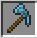

# ToolsJS
A [KubeJS](https://kubejs.com) addon for creating tools! Any type of tools! Includes all tools and features of [CucumberJS](https://git.bluemethyst.dev/CucumberJS), PaxelJS and lots of new ones!

## Dependencies
[Kotlin for Forge](https://modrinth.com/mod/kotlin-for-forge)

[KubeJS](https://modrinth.com/mod/kubejs/)

[Ex Deorum](https://modrinth.com/mod/ex-deorum/) (Optional, if you plan to use tools from that mod)

## Usage
```js
StartupEvents.registry("item", (event) => {
    event.create("test_hammer", "exdeorum:hammer").tag("exdeorum:hammers");
    event.create("test_crook", "exdeorum:crook").tag("exdeorum:crooks");
    event.create("test_mesh", "exdeorum:mesh");
    event.create("test_wateringcan", "exdeorum:watering_can").capacity(3000); //capacity not working
    event.create("test_brush", "brush");
    event.create("test_shield", "shield");
    event.create("test_paxel", "paxel");

    // Below this point are currently have broken textures
    event.create("test_horse_armor", "horse_armor").material("gold");
    //.armorTexture("minecraft:item/diamond_horse_armor");
    event.create("test_wolf_armor", "wolf_armor").material("gold");
    event.create("test_bow", "bow");
    event.create("test_crossbow", "crossbow");
    event.create("fishing_rod", "fishing_rod");
});
```
You can also use built in textures to help create your tools quickly. This one will make the paxel head a different colour.
```js
StartupEvents.registry("item", (event) => {
    event
        .create("test_paxel", "paxel")
        .texture("layer0", "toolsjs:item/paxel_handle")
        .texture("layer1", "toolsjs:item/paxel")
        .color(1, 0x74c7ec);
});
```


### To Do
Fix Bow, Crossbow, and Fishing Rod textures in different states.

## Credits
All paxel code and tagging code from [Cucumber Library by BlakeBr0 under MIT license](https://github.com/BlakeBr0/Cucumber)

All built in textures provided by [FooterManDev](https://github.com/FooterManDev)